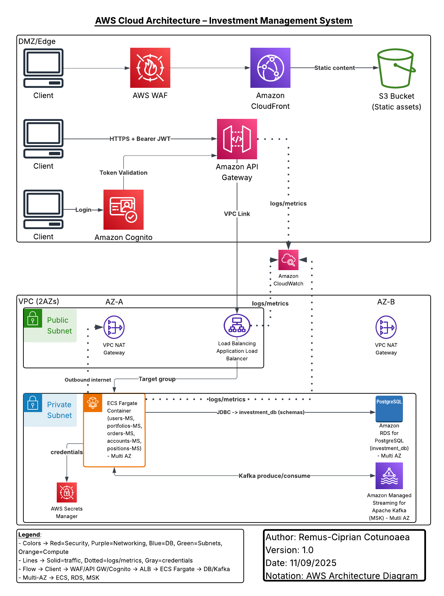

# AWS Architecture – Investment Management System

This folder contains the AWS cloud infrastructure diagram for the **Investment Management System** project.  
The diagram illustrates the deployment of microservices, database, event streaming, and security components within the AWS environment.

---

## 📑 Diagram

- **PNG Version**  
  

- **PDF Version**  
  [Download PDF](AWS_Architecture_Diagram.pdf)

---

## 🔹 Key Components

- **Edge / DMZ**  
  - Amazon CloudFront + AWS WAF + Amazon S3 (static assets)  
  - Amazon API Gateway (entry point with JWT validation via Cognito)  
  - Amazon Cognito (authentication, token issuance)

- **VPC (2 AZs)**  
  - Application Load Balancer (public subnet)  
  - ECS Fargate (5 microservices: users, portfolios, orders, accounts, positions)  
  - Amazon RDS PostgreSQL (investment_db with multiple schemas, Multi-AZ)  
  - Amazon MSK (Kafka topics: orders.order-created, trades.trade-executed, positions.recalculate-requested)  
  - AWS Secrets Manager (credentials)  
  - NAT Gateway (per AZ for outbound internet access)

- **Monitoring**  
  - Amazon CloudWatch (logs & metrics)

---

## 🔹 Notation

- **Notation:** AWS Architecture Diagram  
- **Solid lines** = traffic  
- **Dashed lines** = logs/metrics or credentials  
- **Multi-AZ** = ECS, RDS, and MSK distributed across Availability Zones

---

**Author:** Remus-Ciprian Cotunoaea
**Version:** 1.0  
**Date:** 2025-09-11