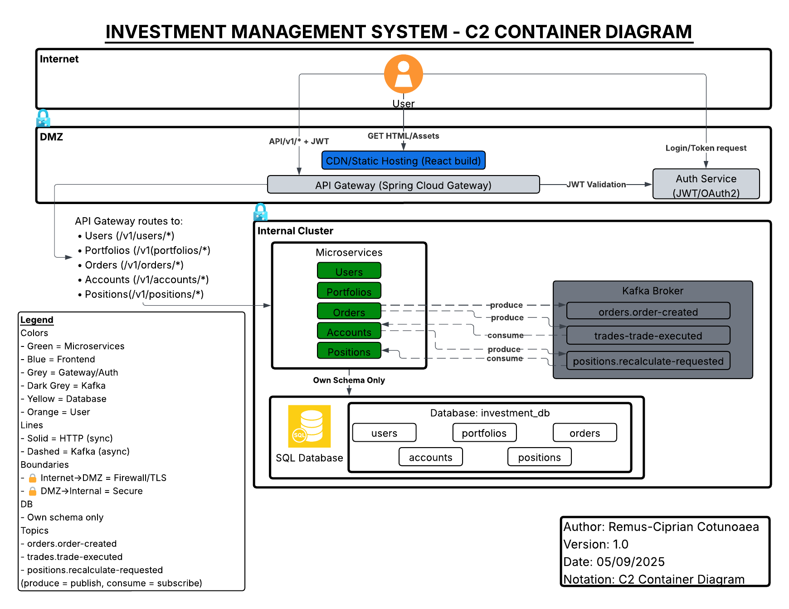

# Investment Management System – C2 Container Diagram

This folder contains the **C2 Container Diagram** of the system, based on the C4 Model.

## Preview

## Files
- `C2-Investment_Management_System.png` – preview for README  
- `C2-Investment_Management_System.pdf` – high-quality export  

## Notes
- **Microservices**: Users, Portfolios, Orders, Accounts, Positions  
- **Database**: `investment_db` (own schema per service)  
- **Kafka Topics**:  
  - `orders.order-created`  
  - `trades.trade-executed`  
  - `positions.recalculate-requested`  

👉 *produce = publish, consume = subscribe*  

---

**Author**: Remus-Ciprian Cotunoaea  
**Version**: 1.0  
**Date**: 05/09/2025  
**Notation**: C2 Container Diagram