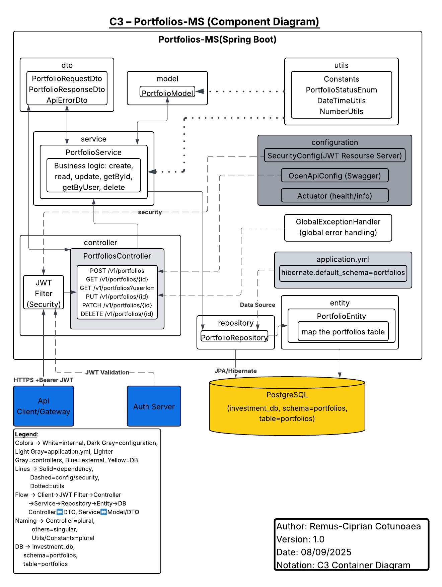
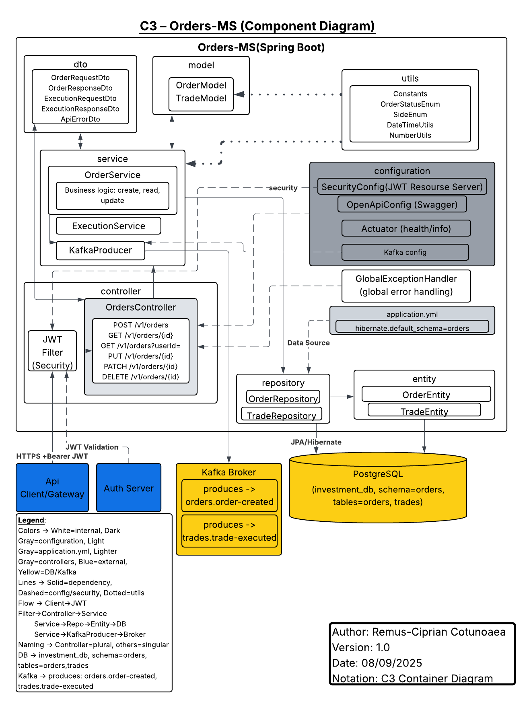
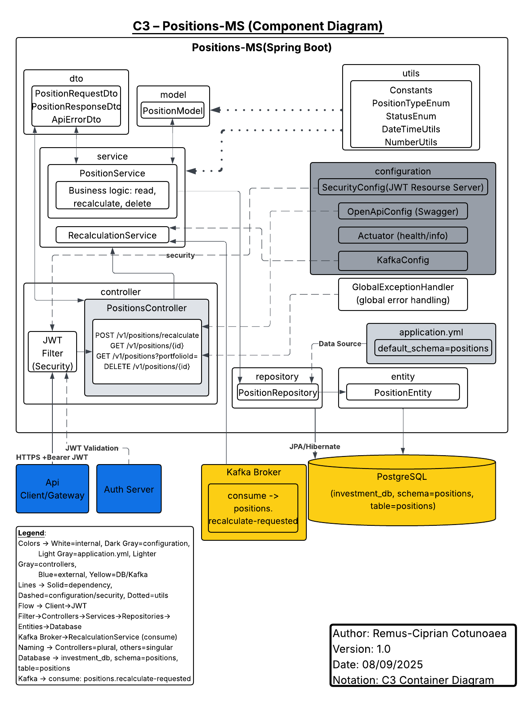

# C3 – Investment Management System

This folder contains the **C3 Component Diagrams** for the Investment Management System.  
Each microservice has its own diagram in PNG format, and there is also a PDF with all diagrams combined.

---

## 📑 Diagrams by Microservice

- **Users-MS**  
  

- **Portfolios-MS**  
  

- **Orders-MS**  
  

- **Accounts-MS**  
  

- **Positions-MS**  
  

---

## 📄 Full PDF
For convenience, all diagrams are also included in a single document:  

[C3 – Investment Management System (PDF)](C3-Investment_Management_System.pdf)