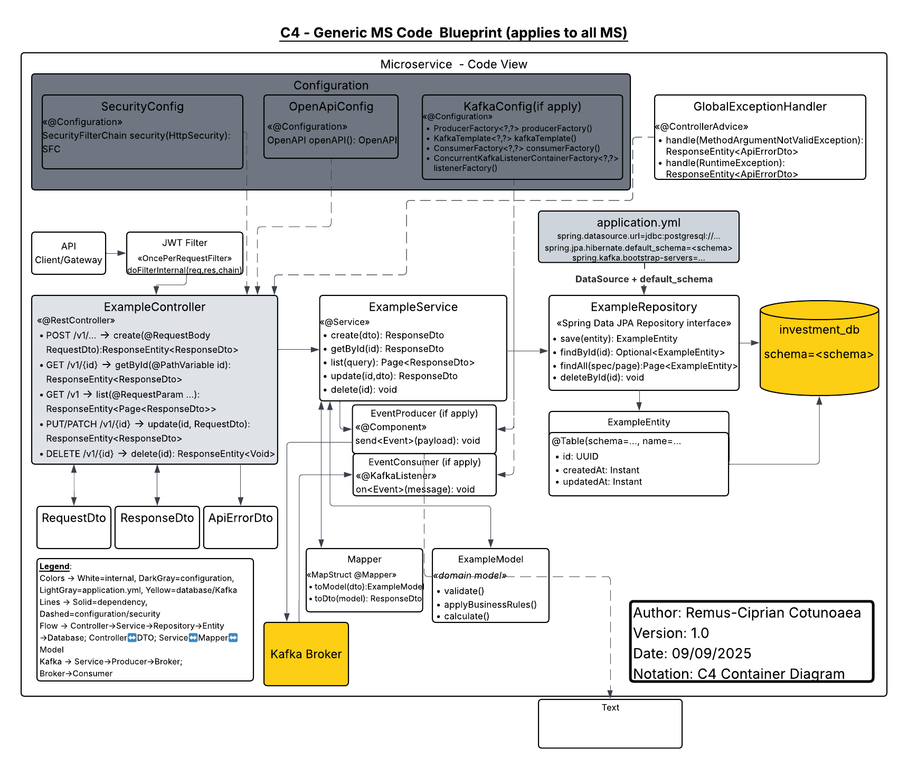

# C4 – Generic Microservice Code Blueprint

This folder contains the **C4 Code-Level Blueprint** used across all microservices in the Investment Management System.  
The diagram illustrates the internal structure of a microservice (Controller, Service, Repository, Entity, DTOs, Mapper, Configuration, Database, Kafka, etc.), providing a reusable reference for all components.

---

## 📑 Diagram

- **Generic MS Code Blueprint (PNG)**  
  

---

## 📄 Full PDF

For convenience, the diagram is also available in PDF format:  

[C4 – Generic MS Code Blueprint (PDF)](C4-Generic_MS_Code_Blueprint.pdf)